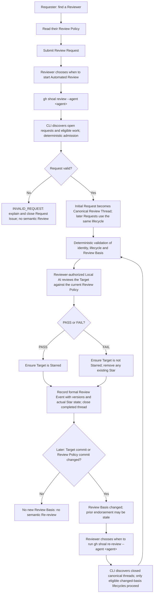

## From a request to a review-backed Star

**Request Review ≠ Request Star.** A Star is a Review outcome, never a promised reward for submitting a request.

The Requester finds a Reviewer and reads their Review Policy before asking for evaluation. The Reviewer owns that Policy and decides when to start reviewing. Protocol rules determine which requests and lifecycles are eligible; submitting a request does not start background AI judgment.

## Read the lifecycle

1. **Find a Reviewer, then read their Policy.** Choose standards relevant to your repository in the Reviewer Directory. A Requester must have valid Reviewer Node Membership and submit their own eligible Target repository; self-review is excluded.
2. **Submit a Review Request.** Use the selected station's canonical Request Review destination. The Issue author supplies their repository name and, optionally, an invitation message. A request waits until the Reviewer chooses to process it.
3. **Admission determines eligibility.** Automated Review discovers current open Request candidates. `INVALID_REQUEST` receives a deterministic explanatory comment and is closed without semantic Review or a Canonical Review Thread. An admitted Initial Request becomes the one Canonical Review Thread for that Reviewer Node and Target Repository.
4. **The Reviewer starts local Automated Review.** `gh shoal review --agent <agent>` discovers eligible work and performs deterministic validation before the Reviewer-authorized local AI evaluates the Target against the Reviewer's current `README.md` Policy. The Reviewer chooses when to start; Protocol eligibility determines what can be reviewed.
5. **Record the outcome and actual Star state.** PASS ensures the Target is Starred, including keeping an existing Star. FAIL ensures it is not Starred, including removing an existing Star. Both leave a formal Review Event with the Target version, Policy version, verdict and actual Star state, then close the completed Canonical Review Thread. A pre-existing social Star alone is not a review-backed endorsement.
6. **Re-review needs a changed Review Basis.** A change to the Target's default-branch commit or the Policy's last-modifying `README.md` commit can make Re-review eligible and a prior endorsement stale. Other station-file changes alone do not change the Policy version. The Reviewer decides when to run `gh shoal re-review --agent <agent>`; the CLI discovers closed canonical threads and only eligible changed-basis lifecycles enter semantic Re-review. It checks the basis again at judgment start; if it has returned to the previous basis, no semantic Re-review occurs.

## One lifecycle, even when a request returns

A Requester may submit a later Request for the same Target. Admission compares the Review Basis: unchanged work receives `NO_NEW_REVIEW_BASIS`, closes the new trigger and leaves the Canonical Review Thread unchanged. A valid changed-basis trigger records `RE_REVIEW_REQUESTED`, reopens the existing Canonical Review Thread and closes the new trigger with a link to that thread. It never creates a second review lifecycle.

During Reviewer-triggered maintenance, Star-state drift alone does not authorize semantic Re-review. The Protocol handles endorsement drift separately. A changed basis permits a new judgment; it does not automatically start one or guarantee PASS.

## Your Policy, your local judgment

The Reviewer authors and owns `README.md`. In Automated Review, the authorized local AI executes the semantic judgment; the CLI validates the result structure and keeps GitHub effects consistent with that verdict. Shoal does not replace it with a platform-wide score or a second human approval step.

Manual Review and Manual Re-review remain valid paths under the same identity, admission, Review Basis, event and actual Star-state rules. The diagram shows the official Automated path; using the CLI is not what makes an endorsement legitimate.
