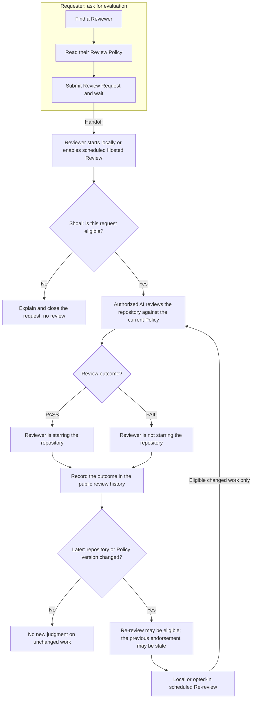

## From a Review Request to a Review outcome

**Request Review ≠ Request Star.** In Shoal, a review-backed Star is a PASS outcome, not something a Requester asks for. A review can also end in FAIL and no Star.

You are the **Requester** when you ask someone to evaluate your repository. The **Reviewer** publishes the standards they use, called their Review Policy. Both share one public review history.

**The handoff:** after you submit a Review Request, you wait for the Reviewer's execution path. They can begin an on-demand review locally or explicitly opt in to recurring Hosted Automated Review in their own station's GitHub Actions. Hosted processing is best-effort and bounded; a request promises neither immediate review nor a Star. Both paths use the shared `gh-shoal` runtime to decide which work is eligible before the authorized AI makes a judgment.



## What happens at each step

1. **Choose whose judgment matters to you.** Find a Reviewer in the Directory and read their Policy before requesting evaluation. Each Reviewer owns their standards; Shoal does not provide a universal score.
2. **Ask, then wait.** Submit your repository name at that station's Request Review destination, with an optional invitation message. The Reviewer controls local execution or explicitly enables a hosted schedule; a request does not promise immediate review or a Star.
3. **Shoal checks whether the request can proceed.** If it cannot, the request receives an explanation and is closed without review. If it can, the work enters that Reviewer's public review history.
4. **The Reviewer controls execution.** Automated Review uses an authorized local AI on demand or Copilot in the Reviewer's own station after explicit Hosted Review opt-in. Both paths use `gh-shoal` for deterministic eligibility and lifecycle rules; the AI only judges the repository against the current Policy.
5. **PASS and FAIL have different outcomes.** PASS means the Reviewer is starring the repository. FAIL means they are not, including removing an existing Star. Both outcomes are recorded publicly with the versions reviewed. An ordinary GitHub Star is not automatically a Shoal review-backed endorsement.
6. **Changed work can be reviewed again.** If the repository version or Review Policy version changes, a previous endorsement may become stale and Re-review may become eligible. The Reviewer controls whether to start locally or permit the corresponding scheduled semantic mode. Unchanged work is not repeatedly sent to the AI for another judgment.

## Local and scheduled execution

Hosted Automated Review runs in the Reviewer's own station, using the same `gh-shoal` Review / Re-review runtime as local execution. It does not move semantic review to the Website or Network Root owner.

The Reviewer-controlled `automated_review` mode is `none` (the default), `review`, `re-review`, or `all`. A non-`none` mode explicitly opts in to recurring semantic work. Copilot availability alone never enables it. Reviewer Summary remains part of every canonical scheduled run regardless of the mode.

Hosted processing is best-effort within a bounded AI budget. If entitlement, quota, budget, timeout, or required evidence prevents judgment, remaining work stays Pending rather than becoming a manufactured FAIL. Already completed work is preserved; independently valid maintenance and Summary work continue. A later run or local command can resume pending work. Hosted capability is optional and does not determine Reviewer Node Membership or base Station Readiness.

### The Reviewer's local commands

For Automated Review, the Reviewer explicitly chooses an installed local AI agent and runs:

```bash
gh shoal review --agent <agent>
```

To revisit eligible work after the repository or Policy changes:

```bash
gh shoal re-review --agent <agent>
```

Replace `<agent>` with the chosen agent's name. These commands run on the Reviewer's machine under their authority. They discover eligible work and validate it before asking the local AI for a judgment; they do not give the Reviewer permission to bypass Shoal's rules.

## The exact Shoal rules behind the overview

### Who can request a review?

A Requester must participate through a valid station repository, formally called **Reviewer Node Membership**. They submit their own eligible repository, using its name rather than another owner's repository URL. Reviewing your own work is excluded. GitHub identifies the Requester through the Issue author.

The eligibility check is **deterministic admission**. The Automated path checks current open Request candidates. An invalid request receives `INVALID_REQUEST`, an explanatory comment, and closure. It never enters semantic Review or becomes a canonical review history.

### Where is the review history kept?

Shoal keeps one review history for the same Reviewer and target repository. The Protocol calls this the **Canonical Review Thread**. An admitted Initial Request becomes that thread; later requests reuse it rather than creating a second lifecycle.

A completed judgment is recorded as a formal **Review Event**, including the Target version, Policy version, PASS / FAIL, and actual GitHub Star state. PASS ensures the Target is Starred, keeping an existing Star if necessary. FAIL ensures it is not Starred, removing an existing Star if necessary. The completed thread is then closed. A social Star gains review backing only when the required valid judgment, versions and actual Star state agree.

### What counts as changed work?

The repository version and Policy version together form the **Review Basis**. The repository version is its default-branch commit; the Policy version is the last commit that modified `README.md` on the Reviewer's default branch. Changes to other station files alone do not change the Policy version.

`re-review` discovers completed, closed canonical threads and eligible pending Re-review work. Only eligible changed-basis lifecycles enter semantic Re-review. The versions are checked again immediately before judgment. If they have returned to the previous judgment's basis, no new semantic review occurs and the canonical thread returns to its completed / closed state.

### What if the Requester submits again?

If neither version changed, there is no new basis for another judgment (`NO_NEW_REVIEW_BASIS`). The new request is closed and the existing review history stays unchanged.

If admission accepts changed work, the new request points back to the existing history and is closed. A `RE_REVIEW_REQUESTED` event records the accepted request and reopens the Canonical Review Thread. Further review continues there; it does not create a second history.

A change to the actual Star state alone is called **endorsement drift**. It can require deterministic maintenance, but does not authorize another AI judgment without a changed Review Basis.

### Who owns the standards and the judgment?

The Reviewer authors and owns their `README.md` Review Policy. In Automated Review, their authorized local AI or hosted Copilot makes the semantic judgment. The CLI validates the result structure and keeps GitHub effects consistent with the verdict; there is no second human approval step.

A Reviewer can also review manually under the same identity, admission, version, event and Star-state rules. Manual Re-review likewise requires a changed Review Basis. The diagram shows the official Automated path; using the CLI is not what makes an endorsement legitimate.

### Public evidence and Manual Review

Each formal Review comment starts with the human result: PASS or FAIL, Target Repository, full Target and Policy commits, actual Star state, review time, and the Reviewer's explanation. A collapsed **Formal Shoal evidence** section carries the machine record. The record is authoritative; editing the visible prose or explanation does not change the formal result.

For Manual Review, capture the same complete Protocol record after verifying the Target, Policy, and actual Star state. Generate the comment with the shared `renderEvidenceComment(record, { explanation })` primitive exported by `src/protocol/services/review_protocol/index.ts` in the Shoal app source. For Admission, supply `{ requestAuthor }` from the Request author's login as well. Publish the generated comment as the Reviewer Node owner on the Canonical Review Thread. The renderer accepts Admission, lifecycle, and judgment records and supplies the human fields from that same record.

Do not replace the generated machine section with prose, shortened commits, or legacy marker-plus-JSON comments. The machine document has envelope `formatVersion: 1`, a complete `record`, and non-authoritative `presentation`; Review Protocol semantics remain version 1. Missing, duplicated, malformed, or unsupported envelopes are rejected. Manual evidence still follows the existing admission, lifecycle, authorship, and Star-state requirements.


## Reading the published Directory and Summary

The Directory is a published **Network Projection**, not a live GitHub query or a ranking of Reviewer quality. Its generation time tells you when that publication was compiled. Station readiness is independent of Summary availability and describes the managed Request surfaces observed by the scan; check the station before acting.

A selected Reviewer Summary is accepted upstream by the Network Aggregator only after checking Reviewer Node identity and Membership, the successful exact workflow Attempt and source repository, the Platform-admitted workflow digest and its bound Action commit and contract, the exact public Summary bytes, cryptographic attestation and run identity, and the Summary schema and embedded Node ID. Public transport is a retrieval surface, not an independent trust anchor. A visible human explanation never substitutes for formal Protocol evidence.

- **Current:** the latest completed qualifying Summary Attempt was accepted. The selected metrics still describe a captured snapshot, not live GitHub state.
- **Fallback:** the latest completed qualifying Attempt was rejected. A prior accepted, retrievable and compatible snapshot is selected and its metrics are stale.
- **Unavailable:** no acceptable snapshot is selected. Metrics are absent, not fabricated zeros. This does not remove a valid member from the Directory.

Follow the detail page’s pinned Policy source, selected Attempt and provenance when evaluating evidence. A later Target, Policy or actual Star change can invalidate review backing before the next successful scan and publication. Public pages, reading files and links grant no authority to edit Policy, Requests, credentials, Stars or repositories.
